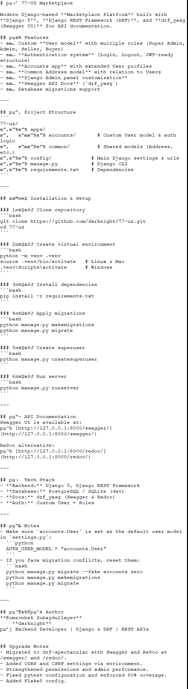

# 77.uz Marketplace API Documentation

## Overview

Bu loyiha — onlayn savdo platformasi bo'lib, foydalanuvchilarga mahsulotlarni qo'shish, sotish va xarid qilish imkoniyatini beradi.

## API Documentation

### Swagger UI
- **URL**: `/api/docs/`
- **Description**: Interactive API documentation with request/response examples

### ReDoc
- **URL**: `/api/redoc/`
- **Description**: Alternative documentation interface

### OpenAPI Schema
- **URL**: `/api/schema/`
- **Description**: Raw OpenAPI 3.0 schema in JSON format

## Authentication

API JWT (JSON Web Token) authentication ishlatadi:

\`\`\`bash
# Login
curl -X POST http://localhost:8000/api/v1/accounts/login/ \
  -H "Content-Type: application/json" \
  -d '{"phone_number": "+998901234567", "password": "password123"}'

# Use token in requests
curl -X GET http://localhost:8000/api/v1/accounts/me/ \
  -H "Authorization: Bearer <access_token>"
\`\`\`

## User Roles

1. **super_admin**: Barcha modullarga to'liq kirish
2. **admin**: Sotuvchilarni qo'shish, ularga login-parol yaratish
3. **seller**: Mahsulot qo'shish va o'chirish
4. **user**: Oddiy foydalanuvchi

## API Endpoints

### Authentication
- `POST /api/v1/accounts/login/` - User login
- `POST /api/v1/accounts/register/` - User registration
- `GET /api/v1/accounts/me/` - Get current user profile
- `PUT /api/v1/accounts/edit/` - Update user profile

### Store
- `GET /api/v1/store/categories/` - List categories
- `GET /api/v1/store/ads/` - List advertisements
- `POST /api/v1/store/ads/` - Create advertisement
- `GET /api/v1/store/ads/{slug}/` - Get advertisement details

### Admin
- `GET /api/v1/admin/users/` - List users (admin only)
- `POST /api/v1/admin/sellers/register/` - Register seller (admin only)

## Error Handling

API standart HTTP status kodlarini ishlatadi:

- `200` - Success
- `201` - Created
- `400` - Bad Request
- `401` - Unauthorized
- `403` - Forbidden
- `404` - Not Found
- `429` - Too Many Requests
- `500` - Internal Server Error

## Rate Limiting

API rate limiting qo'llaydi:
- Authenticated users: 1000 requests/hour
- Anonymous users: 100 requests/hour

## Localization

API ikki tilda ishlaydi:
- `uz` - O'zbek tili (default)
- `ru` - Rus tili

Accept-Language header orqali tilni belgilang:
\`\`\`
Accept-Language: ru
